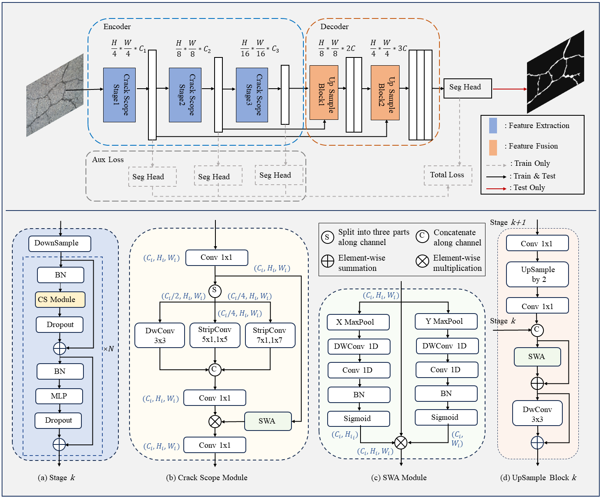

# CrackScopeNet

CrackScopeNet: A Lightweight Neural Network for Rapid Cracks Detection on Resource-Constrained Drone Platforms

</hr>

# Abstract

Detecting cracks during structural health monitoring is crucial for ensuring infrastructure safety and longevity. Using drones to obtain crack images and automate processing can improve the efficiency of crack detection. To address the challenges posed by the limited computing resources of edge devices in practical applications, we propose CrackScopeNet, a lightweight segmentation network model that simultaneously considers local and global crack features while being suitable for deployment on drone platforms with limited computational power and memory. This novel network features a multi-scale branch to improve sensitivity to cracks of varying sizes without substantial computational overhead along with a stripe-wise context attention mechanism to enhance the capture of long-range contextual information while mitigating the interference from complex backgrounds. Experimental results on the CrackSeg9k dataset demonstrate that our method leads to a significant improvement in prediction performance, with the highest mean intersection over union (mIoU) scores reaching 82.12%, and maintains a lightweight architecture with only 1.05 M parameters and 1.58 G floating point operations (FLOPs). In addition, the proposed model excels in inference speed on edge devices without a GPU thanks to its low FLOPs. CrackScopeNet contributes to the development of efficient and effective crack segmentation networks suitable for practical structural health monitoring applications using drone platforms.


# Model Architecture


# Datasets
[CrackSeg9k](https://github.com/Dhananjay42/crackseg9k)

[Ozgenel](https://data.mendeley.com/datasets/jwsn7tfbrp/1)

[Aerial Track Dataset](https://github.com/zhhongsh/UAV-Benchmark-Dataset-for-Highway-Crack-Segmentation)

We train the model on a comprehensive dataset (CrackSeg9k) and subsequently transfer to specific downstream scenarios, concrete crack (Ozgenel) and earthquake crack(Aerial Track Dataset).

# cite
```
@Article{drones8090417,
AUTHOR = {Zhang, Tao and Qin, Liwei and Zou, Quan and Zhang, Liwen and Wang, Rongyi and Zhang, Heng},
TITLE = {CrackScopeNet: A Lightweight Neural Network for Rapid Crack Detection on Resource-Constrained Drone Platforms},
JOURNAL = {Drones},
VOLUME = {8},
YEAR = {2024},
NUMBER = {9},
ARTICLE-NUMBER = {417},
URL = {https://www.mdpi.com/2504-446X/8/9/417},
ISSN = {2504-446X},
DOI = {10.3390/drones8090417}
}

```